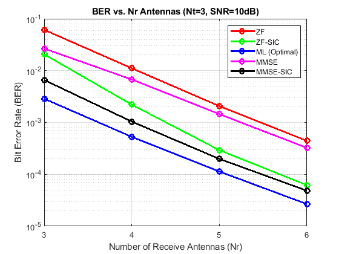
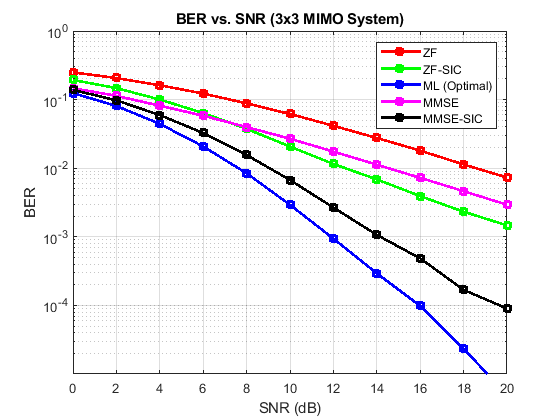

# V-BLAST MIMO Project (BPSK Modulation)

This repository contains a complete MATLAB implementation of a **V-BLAST MIMO system**
using **spatial multiplexing** and **BPSK modulation**.  
The project evaluates and compares different MIMO detection techniques in terms of
**Bit Error Rate (BER)** under Rayleigh fading channels.

---

## 📡 System Model

The baseband MIMO system is described by:

y = Hx + n

Where:
- **x** is the transmitted symbol vector (spatial multiplexing)
- **H** is the Rayleigh fading MIMO channel matrix
- **n** is Additive White Gaussian Noise (AWGN)
- **y** is the received signal vector

### System Assumptions
- BPSK modulation
- Rayleigh flat-fading channel
- Perfect Channel State Information (CSI) at the receiver
- Equal power allocation across transmit antennas

---

## 🧠 Spatial Multiplexing (V-BLAST)

Spatial multiplexing transmits **independent data streams** simultaneously from
multiple transmit antennas.  
This increases **data rate**, but introduces **inter-stream interference**, which
must be handled by the receiver using advanced detection algorithms.

---

## 🔍 Implemented Detectors

### 1️⃣ Zero Forcing (ZF)
- Inverts the channel to remove interference
- Very low computational complexity
- Suffers from **noise amplification**, especially at low SNR

### 2️⃣ Zero Forcing with SIC (ZF-SIC)
- Detects the strongest stream first
- Cancels detected stream before detecting the next
- Improves BER compared to ZF
- Sensitive to error propagation

### 3️⃣ Maximum Likelihood (ML) – Optimal Reference
- Exhaustively checks all possible transmitted symbol vectors
- Chooses the vector minimizing ‖y − Hx‖²
- Provides the **best BER performance**
- Has very high computational complexity

### 4️⃣ Minimum Mean Square Error (MMSE)
- Balances interference suppression and noise enhancement
- More robust than ZF at low and medium SNR
- Widely used in practical MIMO receivers

### 5️⃣ MMSE with SIC (MMSE-SIC)
- Combines MMSE filtering with successive interference cancellation
- Achieves near-ML performance with significantly lower complexity

---

## 📊 Simulation Scenarios and Results

### 🔹 1) BER vs Number of Receive Antennas (Diversity Gain)

- Transmit antennas: **Nt = 3**
- Receive antennas: **Nr = 3, 4, 5, 6**
- Fixed SNR = **10 dB**

**Observation:**
- BER decreases as the number of receive antennas increases
- More receive antennas provide **spatial diversity**, improving stream separation
- SIC-based detectors outperform linear detectors
- ML provides the best performance

📷 Result figure:

<p align="center">
  
  <br>
  <em>Figure 1: BER vs Number of Receive Antennas (Nt = 3, SNR = 10 dB)</em>
</p>


### 🔹 2) BER vs SNR (Detection Performance)

- Fixed system: **3 × 3 MIMO**
- SNR range: **0 to 20 dB**

**Observation:**
- ZF performs worst due to noise amplification
- MMSE improves BER by accounting for noise power
- SIC significantly improves detection performance
- ML consistently achieves the lowest BER

📷 Result figure:

<p align="center">
  
  <br>
  <em>Figure 2: BER vs SNR (3 × 3 MIMO System)</em>
</p>


---

## ⏱ Detector Complexity and Performance Trade-Off

| Detector     | Complexity | BER Performance |
|--------------|------------|-----------------|
| ZF           | Very Low   | Poor            |
| ZF-SIC       | Low–Medium | Good            |
| MMSE         | Medium     | Better          |
| MMSE-SIC     | Medium–High| Near-Optimal    |
| ML           | Very High  | Optimal         |

---

## 🧠 Key Insights

- Spatial multiplexing increases data rate but introduces interference
- Increasing receive antennas improves BER due to spatial diversity
- ZF cancels interference but amplifies noise
- MMSE balances noise and interference effectively
- SIC improves performance by removing interference step-by-step
- ML provides optimal performance at the cost of complexity

---

## 🛠 How to Run the Code

1. Open MATLAB
2. Ensure the project folder structure is preserved
3. Run:
```matlab
main
V-BLAST-MIMO-Project/
│
├── main.m
├── src/
│   ├── run_mimo_sim.m
│   └── sic_detect.m
├── plots/
│   ├── BER_vs_Nr.png
│   └── BER_vs_SNR.png
└── README.md
